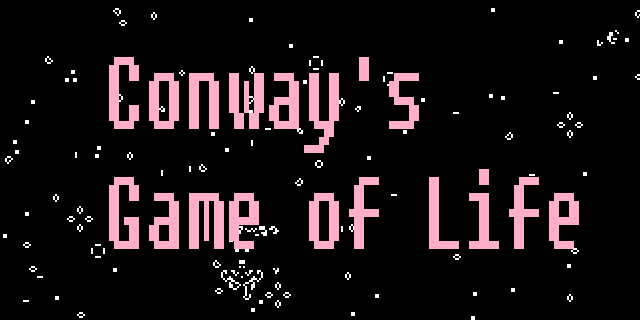

# Challenge week 6

## Conway Game of Life 🦠

You must program the [Conway's Game of Life](https://es.wikipedia.org/wiki/Juego_de_la_vida).

A summary of the rules:

-   A living cell follows the following rules:
    -   If it has less than 2 contiguous living cells, it dies from "loneliness".
    -   If it has more than 3 contiguous live cells, it dies from "overpopulation".
    -   If it has 2 or 3 live contiguous cells, it survives.
-   A dead cell follows the following rule: It remains dead until it has exactly 3 living contiguous cells, at which point it is "born".

If you want to test how it works to get an idea, you can try a working version at [this page](https://playgameoflife.com/).

## Requirements

1. Must be tested with Jest.
2. SonarQube must be used to check the quality of the code.
3. Husky will be used to manage the git-hooks, using the attached files.
4. GitActions should be used for the attached workflow.
5. Main should be protected in GitHub so that everything that is merged goes through pull-request and the workflow is fulfilled.
6. In the case of HTML/CSS.
    - BEM/SASS shall be used.
    - Netlify must be deployed.

## Milestones

1. Functional program in JS. Cells stick to the wall.
2. 100% tested program.
3. Add HTML/CSS.
4. Modify JS so that:
    - Cells continue to move forward when they reach the wall and disappear.
    - Cells exit on one side of the grid and appear on the other.
